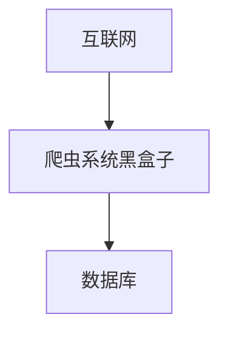
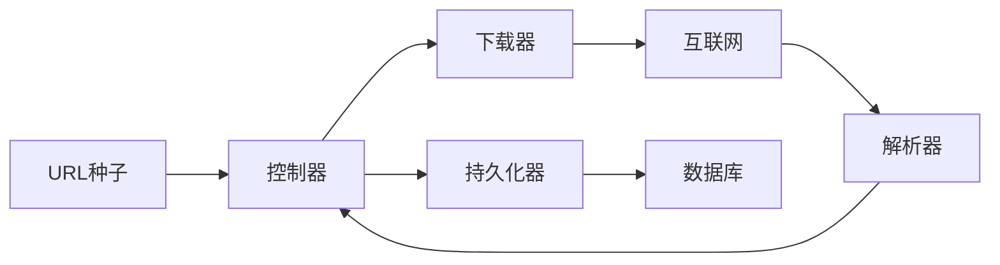
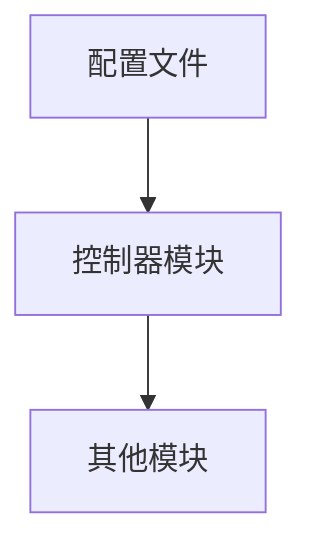
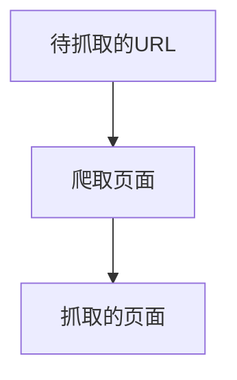

# idk-spider


## 1.什么是爬虫

爬虫：是一个软件机器人，是可控的，可以从互联网上抓取我们所需的资源。爬虫是搜索引擎后台的第一个子系统，是数据入口之一

## 2.爬虫能做什么

- 搜索引擎
- 抓取数据
- 网页下载器
- 秒杀

## 3.关于项目

> src、module、download、makefile、conf、exe

**需求**：你想要干什么

**设计**：分为**业务设计**和**技术设计**

- 业务设计：业务层的方案。对于软件工程师而言，业务就是我们想要系统地完成一个工作，需要经过哪些**步骤和流程**

- 技术设计：关于框架和处理流程，注意要采用面向对象的思维模式

**编码**：使用基本的技术细节进行系统的实现

**测试**：对于我们的系统的可靠性的检测

**集成**：将每个程序员开发的模块或者子系统合成为完整的系统


软件开发要掌握的**思想**

- 模块思维
- 渐进式开发：抓取网页->抓取图片->抓取视频


## 4.需求

**自动**抓取网络**资源**的软件

-  资源：网页、图片、音乐、视频
- 自动化：一旦运行就不需要更多的干预

**生成需求说明文档**

- **内容**：对需求中不明确或不完善的说明进行解释

功能点、附加要求、性能要求


## 5.设计

**业务设计**

如何思考并完成设计

- 从顶层开始思考并设计，**避免过早地陷入细节**


**数据流**




设计处理流程

1. 得到爬取种子（URL）

2. 根据爬取种子来下载资源（页面）

3. 解析页面，拿到更多的URL

4. 对页面做持久化操作

5. 根据提取的URL再进行下载操作

6. 重复




> 详细设计：对于模块的设计要有输入输出

## 6.控制器

该模块构成：

- 配置文件处理模块
- URL维护模块（URL列表）
- 任务调度模块





1. 配置文件处理模块：从配置未见中读取配置项，提供配置项的提取接口

2. URL维护模块：**负责维护URL库**

   - 输入新的URL

   - 输出一个未被抓取的URL

   - 负责维护URL的抓取状态

3. 任务调度模块
   - 负责协调控制器的流程
   - 负责调用其他系统模块完成调用
4. URL列表


## 7.下载器


输入:待抓取的URL-->爬取页面-->抓取的页面



爬虫：发起http请求、接受http响应

- http处理模块
- socket功能模块

## 8.解析器

文本文件数据流-->html解析模块-->URL列表

## 9.持久化器

输入-->页面保存模块、图片保存模块、视频流保存模块、音乐流保存模块-->输出


## 10.控制器设计

### 10.1 配置文件解析模块

> 配置文件是以文件形式保存程序运行时必要的参数，减少输入时的繁琐过程

1. 键=值

2. **#**是注释的开头

配置项设置

1. 深度

2. 并发数量
3. URL种子
4. 模块存放路径（唯一的）
5. 模块名称（可以有多个）
6. 允许抓取的资源类型（多个、后缀）
7. 输出日志等级

流程

- 读取配置文件
- 得到配置文件的内容
- 初始化

技术点

- 按行读取 fgets
- 切割字符串
- 消除注释
- 消除空格


### 10.2 URL维护模块

用类封装一下每个url

```cpp
class URL {
	string _url;
    string _protocol;
    string _domain;
   	string _ip;
    string _path;
};
// list
// set
// queue
```

- 得到URL
- URL进入等待队列等到抓取
- 给URL分配一个下载器实例
- 得到抓取的状态（是否成功，深度是多少）


### 10.3 任务调度模块

#### 10.3.1 程序的主框架流程

要求

1. 可以控制程序按照普通程序模式还是按照守护进程模式运行
2. 可以通过参数提供帮助
3. 提供一个运行框架，可以支持多任务管理
4. 包含程序的主流程

尽可能把可拆分的功能封装成独立函数进行调用


#### 10.3.2 定义主程序框架的处理流程

1. 程序运行时先处理命令行参数，根据参数跳转不同的分支或调用不同的函数
2. 检测是否按照守护进程模式运行（控制选项从命令行参数得到）
3. 初始化环境
   - 读取配置文件，提取配置文件中的参数
   - 根据守护进程模式的标记将当前进程转变为守护进程
   - 载入程序模块的动态库
4. 开始程序的主处理流程
   - 检测种子是否存在，把种子交给URL管理器
   - 分析种子，得到种子URL的IP地址（DNS解析）
   - 根据种子的IP得到第一个页面
   - 对页面进行处理（复杂流程，由其他模块实现细节）
   - 从URL管理器中取出一个URL
   - 启动一个任务处理（先检测是否达到最大任务数量，功能封装到一个独立函数中）
   - 监控任务处理数量，如果任务维护池中由空闲任务，那么重复从URL管理器取出任务，处理
   - 回收资源，准备结束程序或当前任务


继续分解复杂步骤

#### 10.3.3 对页面进行处理

1. 对页面进行解析，提取内部的下级URL
2. 生成URL列表，把URL列表传给URL管理器
3. 对于页面进行持久化操作


#### 10.3.4 启动处理任务

1. 从URL管理器得到一个未处理的URL
2. 通过调用epoll框架产生一个新任务
3. 调用对页面进行处理的模块（上面的步骤）
4. 释放处理过程中的产生的临时资源（socket句柄，文件操作句柄，临时申请的内存），准备结束程序或当前任务


其他辅助功能

1. 输出帮助信息


# 多路复用框架

为什么不用select而用epoll

select

- 文件句柄**数量受限制**

- 需要第三方数组

   

Linux下设计并发网络程序，有

- PPC模型
- TPC模型：少量的连接，复杂的业务处理
- select模型
- epoll模型：大量的连接，少量的业务处理

多进程/多线程模型能够接受的最大连接数都不会很高


连接远端服务器

从服务器获得数据（IO操作）

处理得到的数据（非IO操作）

对数据进行业务操作（非IO操作）

向远端服务器发送反馈（IO操作）


# 插件模式

为什么要有插件模式

- 升级和扩充方便
- 维护方便
- 动态修改


## 设计

1. 动态载入.so
2. 维护.so文件中的函数接口

## 设计原则

1. 一个功能一个模块
2. 可以自我维护
   - 维护版本号
   - 知道自己的名称
   - 维护自己的接口
   - 对模块进行初始化

## 设计模块的结构


# 日志工具

**为什么需要日志工具**

1. 方便调试
2. 方便代码维护

**日志输出信息设计**

- 日志时间
- 调试信息

**日志等级**

- DEBUG：仅仅用于调试
- INFO：可以让使用者了解的一些信息
- WARNING：意味着程序中出现了错误，但是并不严重
- ERROR：意味着程序中出现了严重错误，根据实际情况可选择使程序继续运行或使程序终止
- FATAL：程序无法继续运行了


> 需要控制日志信息输出到**终端**还是输出到**日志文件中**


**日志调用接口设计**

```LOG(日志等级标记，日志输出信息)```

注意：**配置文件**中日志输出等级端和接口中的日志等级不是一个概念；日志等级标记，纯粹是一个标记，体现在输出的日志字符串中；配置文件中的日志输出等级字段用来控制哪些日志被输出


**接口内部的处理流程**

1. 得到控制日志输出等级的标记，用来控制当前的日志是否要输出
2. 得到调用日志输出接口的时间
3. 得到日志输出信息并进行日志字符串的拼接
4. 把日志信息输出到指定的设备

```cpp
#define LOG(level, format, ... )
```

